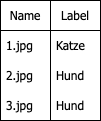
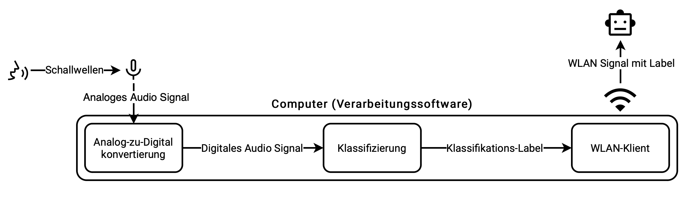
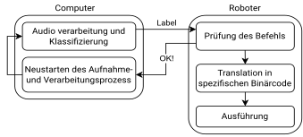
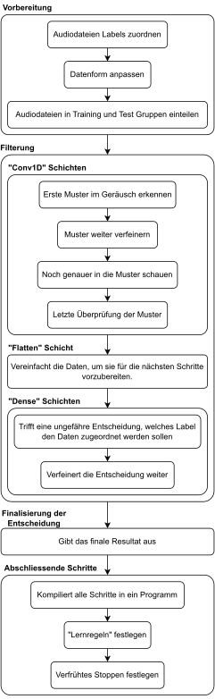
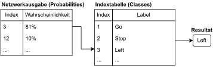

# SpeechPilot
A library to control a robot with speech recognition

## Requirements
- [Python 3.10.13](https://www.python.org/downloads/release/python-31013/)
- [Whisper](https://pypi.org/project/openai-whisper/)
- [pyAudio](https://pypi.org/project/PyAudio/)
### Optional
[CUDA 11.8](https://developer.nvidia.com/cuda-11-8-0-download-archive). This is technically not required, but it will speed up the speech recognition by a lot. **Needs a Nvidia GPU!** 
For this to work you also need [Visual Studio 2019](https://visualstudio.microsoft.com/de/downloads/) or above.
You also need to install [pyTorch](https://pytorch.org/get-started/locally/) with CUDA support
### Additional tools
#### Graph_generator.py
The Graph generator was used to generate the example picture in my work report. It generates a simple sine wave with a bar graph below it. There are two different bar graphs to show the difference between varying sample rates.
 
 

[Sample rate graph](https://github.com/NilsBriggen/SpeechPilot/blob/stable/Abtastraten.png) © 2023 by [Nils Briggen](https://github.com/NilsBriggen) is licensed under [CC BY-SA 4.0](https://creativecommons.org/licenses/by-sa/4.0/)
### Pictures
[Example table](https://github.com/NilsBriggen/SpeechPilot/blob/stable/Table.png) © 2023 by [Nils Briggen](https://github.com/NilsBriggen) is licensed under [CC BY-SA 4.0](https://creativecommons.org/licenses/by-sa/4.0/) 

[The basic system](https://github.com/NilsBriggen/SpeechPilot/blob/stable/System.svg) © 2023 by [Nils Briggen](https://github.com/NilsBriggen) is licensed under [CC BY-SA 4.0](https://creativecommons.org/licenses/by-sa/4.0/) 

[The computer system](https://github.com/NilsBriggen/SpeechPilot/blob/stable/ComputerSystem.png) © 2023 by [Nils Briggen](https://github.com/NilsBriggen) is licensed under [CC BY-SA 4.0](https://creativecommons.org/licenses/by-sa/4.0/) 

[The communication system](https://github.com/NilsBriggen/SpeechPilot/blob/stable/CommunicationSystem.svg) © 2023 by [Nils Briggen](https://github.com/NilsBriggen) is licensed under [CC BY-SA 4.0](https://creativecommons.org/licenses/by-sa/4.0/) 

[The network configuration](https://github.com/NilsBriggen/SpeechPilot/blob/stable/Config.svg) © 2023 by [Nils Briggen](https://github.com/NilsBriggen) is licensed under [CC BY-SA 4.0](https://creativecommons.org/licenses/by-sa/4.0/) 

[Result evaluation](https://github.com/NilsBriggen/SpeechPilot/blob/stable/Evaluation.svg) © 2023 by [Nils Briggen](https://github.com/NilsBriggen) is licensed under [CC BY-SA 4.0](https://creativecommons.org/licenses/by-sa/4.0/) 

[WLAN Communication](https://github.com/NilsBriggen/SpeechPilot/blob/stable/WLAN.svg) © 2023 by [Nils Briggen](https://github.com/NilsBriggen) is licensed under [CC BY-SA 4.0](https://creativecommons.org/licenses/by-sa/4.0/) 

 
 
#### Icons used in pictures
Google LLC. Voice Selection. Lizenziert unter Apache-Lizenz 2.0
 
https://fonts.google.com/icons?selected=Material%20Symbols%20Outlined%3Avoice_selection%3AFILL%400%3Bwght%40400%3BGRAD%400%3Bopsz%4048
Google LLC. Mic. Lizenziert unter Apache-Lizenz 2.0
 
https://fonts.google.com/icons?selected=Material%20Symbols%20Outlined%3Amic%3AFILL%400%3Bwght%40400%3BGRAD%400%3Bopsz%4048
Google LLC. Wifi. Lizenziert unter Apache-Lizenz 2.0
 
https://fonts.google.com/icons?selected=Material%20Symbols%20Outlined%3Awifi%3AFILL%400%3Bwght%40400%3BGRAD%400%3Bopsz%4048
Google LLC. Smart Toy. Lizenziert unter Apache-Lizenz 2.0
 
https://fonts.google.com/icons?selected=Material%20Symbols%20Outlined%3Asmart_toy%3AFILL%400%3Bwght%40400%3BGRAD%400%3Bopsz%4048
Google LLC. Computer. Lizensiert unter Apache-Lizenz 2.0
 
https://fonts.google.com/icons?selected=Material%20Symbols%20Outlined%3Acomputer%3AFILL%400%3Bwght%40400%3BGRAD%400%3Bopsz%4024
Google LLC. Laptop Windows. Lizenziert unter Apache-Lizenz 2.0
 
https://fonts.google.com/icons?selected=Material%20Symbols%20Outlined%3Alaptop_windows%3AFILL%400%3Bwght%40400%3BGRAD%400%3Bopsz%4024
Google LLC. Router. Lizenziert unter Apache-Lizenz 2.0
 
https://fonts.google.com/icons?selected=Material%20Symbols%20Outlined%3Arouter%3AFILL%400%3Bwght%40400%3BGRAD%400%3Bopsz%4024
Google LLC. Code. Lizenziert unter Apache-Lizenz 2.0
 
https://fonts.google.com/icons?selected=Material%20Symbols%20Outlined%3Acode%3AFILL%400%3Bwght%40400%3BGRAD%400%3Bopsz%4024
Google LLC. Terminal. Lizenziert unter Apache-Lizenz 2.0
 
https://fonts.google.com/icons?selected=Material%20Symbols%20Outlined%3Aterminal%3AFILL%400%3Bwght%40400%3BGRAD%400%3Bopsz%4024
 
 
## My Progress in SpeechPilot
### 19.06.2023

Done:
- control libary finished and checked robot functions
- Implemented the first version of the speech recognition with whisper and turtle

Problems:
- The speech recognition is slow (probably because I'm using the API)
- Tensorflow doesn't work on the Raspberry Pi Zero
- The Picon Board is instable and can disconnect from the Raspberry Pi Zero

### 20.06.2023
Done:
- Implemented my own speech recognition with Tensorflow

Problems:
- The Tensorflow model isn't giving a usable output (probably because of the model or the microphone input)

### 21.06.2023
Done:
- Implemented a new speech recognition with a local model of whisper
- Implemented Wlan/Bluetooth communication with the Raspberry Pi Zero (Work in Progress)
- The Whisper model is now fast enough to be used in real time

Problems:
- The Wlan communication gets refused by the server (probably because of a firewall)
- The Bluetooth communication doesn't work in Linux

### 22.06.2023
Done:
- The Wlan communication works now
- The Robot fully works with the "remote" speech recognition

Problems:
- My own model still doesn't work

### 23.06.2023
Done:
- The tiny.en model is too large for the Raspberry Pi Zero. The conversion will have to be done outside of the Raspberry Pi
- Cleaned up code

Problems:
- My own model still doesn't work

## Todo:
- Try to fix my model
- Write the paper
